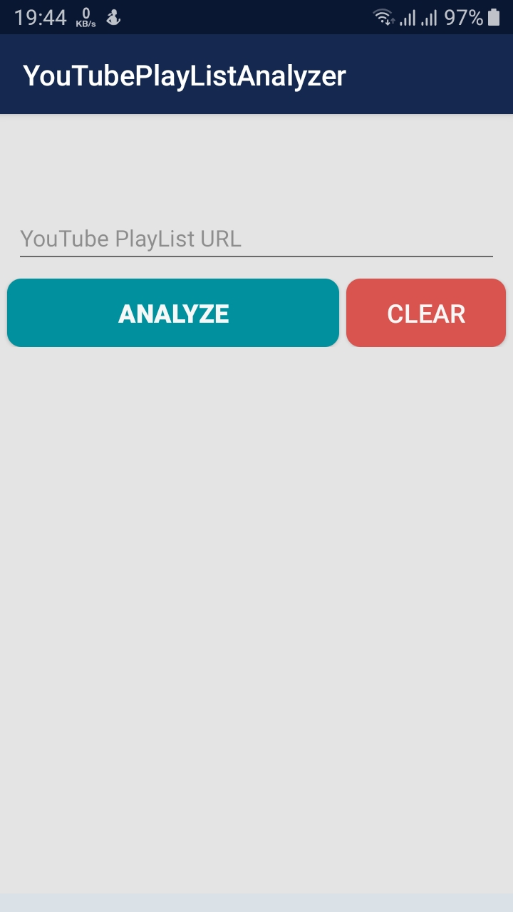
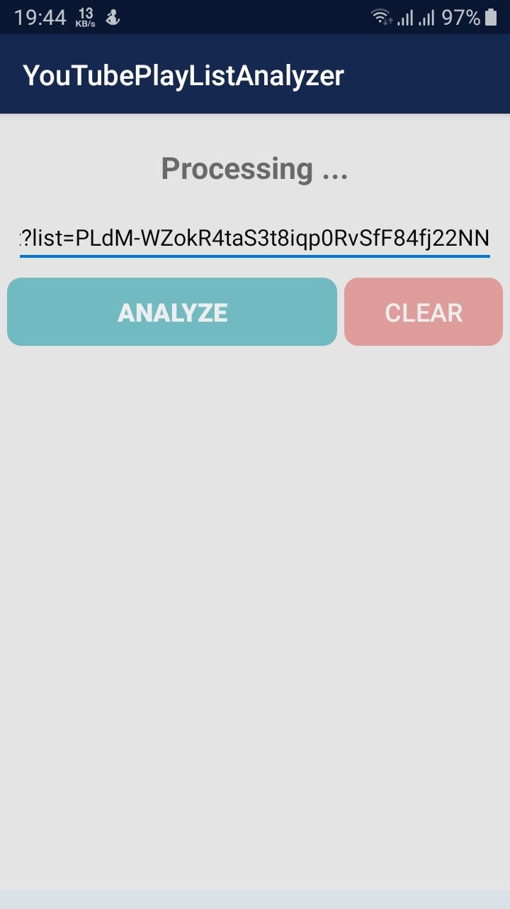
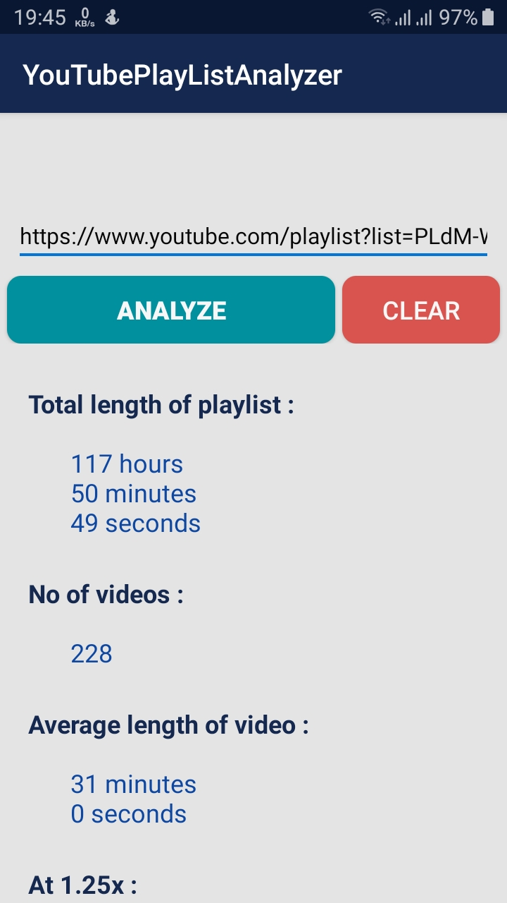
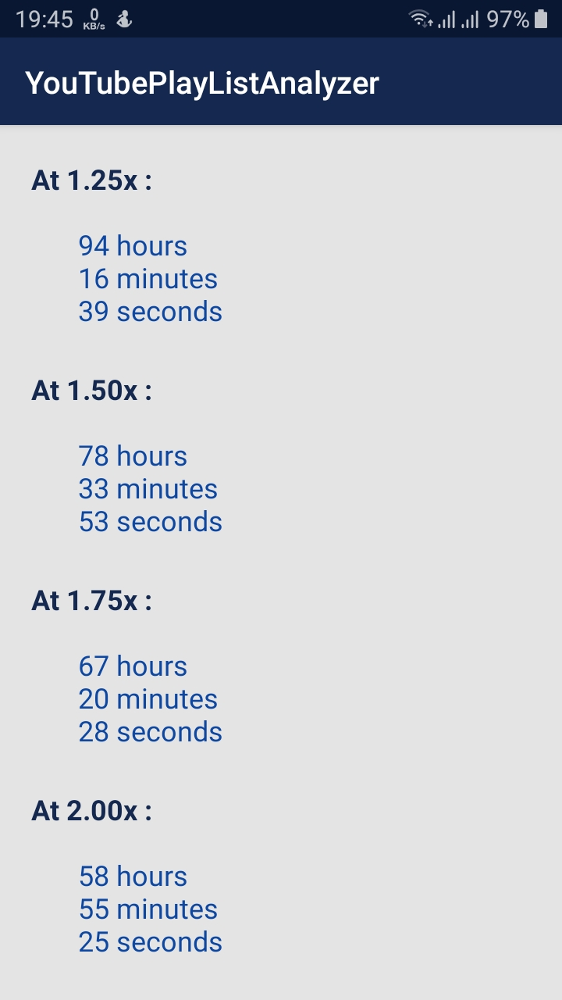

# YouTube-PlayList-Analyzer
#### A simple Android App to calculate the total duration of any YouTube playlist
---
<table>
  <tr>
    <td>  </td>
    <td>  </td>
  </tr>
  <tr>
    <td>  </td>
    <td>  </td>
  </tr>
</table>

 

* __To run the project put a valid YouTube Data API in : app/src/main/java/com/example/youtubeplaylistanalyzer/YouTubeConfig.java__
* __The apk file is present in : app/release/__
